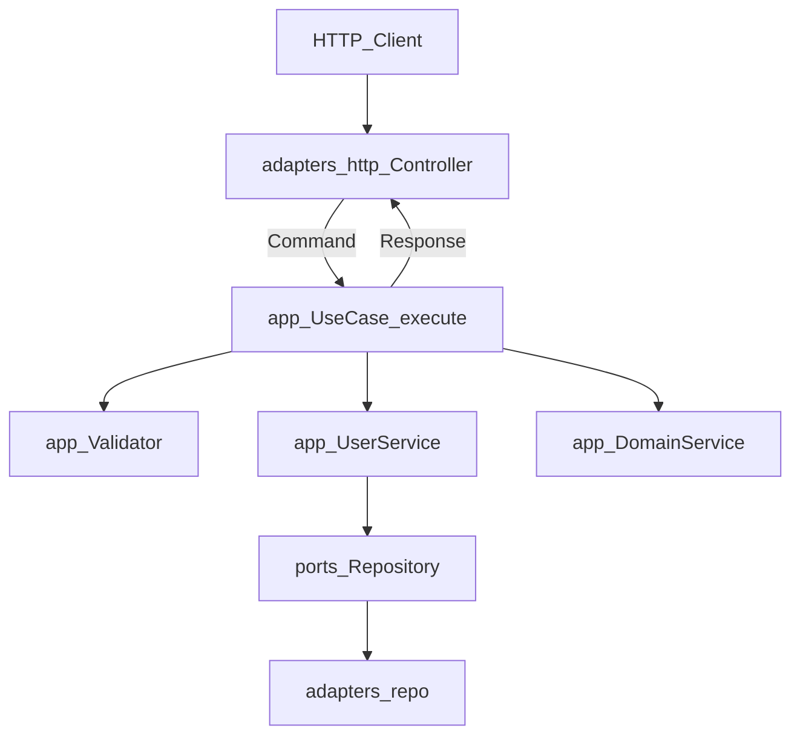

# ARCHITECTURE-SKILL — Clean Architecture Development Guide

Use this skill when designing or implementing features in this repository (Java 21, Spring Boot 3, Maven monorepo).

Goals:

- **Readable** business flow for humans (especially `execute()` in use cases).
- **Testable** units (small private methods, ports mocked in tests).
- **Clear boundaries** between web, application, domain rules, and infrastructure.

---

## Layer overview

```text
com.selecty.<app>/
  Application.java                    # Spring Boot entry only

  internal/
    adapters/
      http/                            # REST controllers, API DTOs, HTTP mappers
        <feature>/
          *Controller.java
          *Request.java / *Response.java (records)
          *HttpMapper.java            # DTO <-> command/response (optional)
      repo/                           # JPA / JDBC / in-memory — implements ports
      openmeteo/                      # (other modules) external API clients
      mcp/                            # (other modules) protocol adapters

    app/                              # Application layer — USE CASES
      <feature>/
        *UseCase.java                 # @FunctionalInterface + execute()
        *UseCaseImpl.java             # or single class if trivial
        command/                      # input models for use cases
        response/                     # output models for use cases
        validator/                    # use-case-level validation (optional package)
        *Service.java                 # e.g. UserService — owns repository access for an aggregate
        *DomainService.java           # auxiliary helpers (policy, calculator — no repository)

    ports/                            # Interfaces outward dependencies (used by *Service, not by use cases)
      *Repository.java
      *Gateway.java

    domain/                           # Entities, value objects (optional, no Spring)
    auth/                             # Cross-cutting helpers (e.g. session binding)
    config/                           # Spring @Configuration, SecurityFilterChain
```

**Dependency rule (strict)**

| Layer | May depend on |
|-------|----------------|
| `adapters/http` | `app` (use cases, commands, responses), `auth` helpers |
| `app` (use cases) | `app` (*Service, validators, domain), `domain` — **not** `ports`, **not** Spring Web, JPA, JDBC |
| `app` (*Service) | `ports`, `domain`, other `app` types — **only layer that talks to ports** for persistence/API |
| `ports` | `domain` only (or standalone types) |
| `adapters/repo` | `ports`, `domain`, Spring Data / JDBC |
| `config` | Spring, wires implementations to interfaces |

`internal.app` must **not** import framework-specific adapter types (repositories implementations, controllers, entities from JPA if avoidable — map in adapter).

---

## Use case — central pattern

### Functional interface

Every use case is a **`@FunctionalInterface`** with exactly one entry point:

```java
@FunctionalInterface
public interface LoginUseCase {
  LoginResponse execute(LoginCommand command);
}
```

Naming:

- Interface: `<Verb><Noun>UseCase` — `RegisterUserUseCase`, `GetCurrentUserUseCase`
- Input: `<Name>Command` (immutable record preferred)
- Output: `<Name>Response` (immutable record preferred)

### `execute()` — mandatory flow

The `execute()` method is the **table of contents** for the feature. A developer should understand the scenario without opening private methods.

**Fixed order:**

1. **`validate(command)`** — input validation, authorization pre-checks that belong to the use case
2. **Business steps** — one or more private methods with **speaking names** (no nested `if-else` blocks in `execute()`)
3. **`mapResponse(...)`** — build the response DTO/record
4. **`return`** the response

**Template**

```java
public final class LoginUseCaseImpl implements LoginUseCase {

  private final UserService userService;
  private final PasswordHasher passwordHasher;
  private final LoginValidator loginValidator;

  public LoginUseCaseImpl(
      UserService userService,
      PasswordHasher passwordHasher,
      LoginValidator loginValidator
  ) {
    this.userService = userService;
    this.passwordHasher = passwordHasher;
    this.loginValidator = loginValidator;
  }

  @Override
  public LoginResponse execute(LoginCommand command) {
    validate(command);

    AuthenticatedUser user = authenticate(command);

    return mapResponse(user);
  }

  private void validate(LoginCommand command) {
    loginValidator.validate(command);
  }

  private AuthenticatedUser authenticate(LoginCommand command) {
    UserAccount account = loadAccountForLogin(command.username());
    assertPasswordMatches(command.password(), account);
    return toAuthenticatedUser(account);
  }

  private LoginResponse mapResponse(AuthenticatedUser user) {
    return new LoginResponse(user.username(), user.roles());
  }

  // --- small, testable steps below (no repository here) ---

  private UserAccount loadAccountForLogin(String username) {
    return userService.getByUsernameOrThrow(username);
  }

  private void assertPasswordMatches(String rawPassword, UserAccount account) {
    if (!passwordHasher.matches(rawPassword, account.passwordHash())) {
      throw new InvalidCredentialsException();
    }
  }

  private AuthenticatedUser toAuthenticatedUser(UserAccount account) {
    return new AuthenticatedUser(account.username(), account.roles());
  }
}
```

**`UserService`** (repository lives here, not in the use case):

```java
public final class UserService {

  private final UserRepository userRepository;

  public UserService(UserRepository userRepository) {
    this.userRepository = userRepository;
  }

  public UserAccount getByUsernameOrThrow(String username) {
    return userRepository.findByUsername(username)
        .orElseThrow(() -> new InvalidCredentialsException());
  }

  public void register(UserAccount account) {
    userRepository.save(account);
  }
}
```

### Rules for `execute()`

| Rule | Detail |
|------|--------|
| Readability | `execute()` should read like a short story: validate → do work → return |
| No branching in `execute()` | Replace `if/else`, `switch`, loops with **named private methods** |
| One level of abstraction | `execute()` calls private methods; it does not contain low-level details |
| Single return type | Always return the declared response type (or throw domain exceptions) |
| No HTTP / SQL | No `HttpServletRequest`, `@Transactional` is acceptable on impl if needed, but prefer transaction on `*Service` or adapter |
| No repository in use case | Use case calls `UserService` / `OrderService`, never `UserRepository` directly |

**Bad `execute()` (do not do this)**

```java
public LoginResponse execute(LoginCommand command) {
  if (command.username() == null || command.username().isBlank()) {
    throw new ValidationException("username");
  }
  var user = userService.getByUsernameOrThrow(command.username());
  if (!passwordHasher.matches(command.password(), user.passwordHash())) {
    throw new InvalidCredentialsException();
  }
  return new LoginResponse(user.username(), user.roles());
}
```

**Good** — same logic, split into `validate`, `authenticate`, `mapResponse`, and helpers.

---

## Validators

| Type | Responsibility | Location |
|------|----------------|----------|
| **Use-case validator** | Business rules on command (ranges, required fields, cross-field rules) | `internal.app.<feature>.validator` or method `validate()` delegating to `*Validator` class |
| **Bean Validation (`@Valid`)** | HTTP shape / format | Request DTO in `adapters/http` + `@Valid` on controller parameter |
| **Domain invariants** | Rules tied to entity/value object | Methods on `domain` types |

Use-case `validate()` should call a dedicated validator when rules grow beyond a few lines:

```java
private void validate(RegisterUserCommand command) {
  registerUserValidator.validate(command);
}
```

Validators are **stateless** and easy to unit-test without Spring.

---

## Application services (`*Service`)

**`*Service`** (e.g. `UserService`, `OrderService`) — the **only** application layer that talks to **ports/repositories** for a given aggregate or bounded context.

| Responsibility | Owner |
|----------------|--------|
| Load / save / query persistence | `*Service` |
| Hide `Optional`, map “not found” to domain exceptions | `*Service` |
| Orchestrate a user-facing scenario | **Use case** (calls `*Service`, not repository) |

Rules:

- **Use case** injects `UserService`, **not** `UserRepository`.
- **`*Service`** injects `UserRepository` (port) and encapsulates all DB access for users.
- One use case may call several services (`UserService` + `NotificationService`).
- Keep service methods **focused** (`getByUsernameOrThrow`, `register`, `existsByEmail`) — not a copy of the whole use case.

Naming: `<Aggregate>Service` or `<BoundedContext>Service` — `UserService`, not `UserRepositoryService`.

---

## Auxiliary services (domain services)

Use **`internal.app.<feature>.*DomainService`** (or `*Policy`, `*Calculator`) for **pure logic without persistence**:

- Password strength policy, pricing calculator, idempotency key builder
- No repository inside `*DomainService`

| Type | Has repository? | Example |
|------|-----------------|--------|
| `*Service` | Yes | `UserService` → `UserRepository` |
| `*DomainService` | No | `PasswordPolicy`, `TaxCalculator` |
| `*UseCase` | No (delegates to services above) | `LoginUseCaseImpl` |

Use cases **orchestrate**; `*Service` **loads and stores**; `*DomainService` **computes** reusable rules.

---

## Repositories and ports

- **Port** — `internal.ports.UserRepository` (interface)
- **Adapter** — `internal.adapters.repo.JpaUserRepository` implements port
- **Consumer** — `UserService` (and similar), **not** use cases

```java
// port — used only from *Service (or adapter tests)
public interface UserRepository {
  Optional<UserAccount> findByUsername(String username);
  void save(UserAccount user);
}
```

Map JPA entities ↔ domain/application models **inside the repository adapter**, not in the use case or `*Service` when avoidable.

**Do not** inject `JpaRepository` into use cases or into `*Service` — always go through the port interface.

---

## Web controllers

Controllers are **thin**:

1. Accept HTTP request (`@RequestBody`, path vars)
2. Optional Bean Validation (`@Valid`)
3. Map request → **command** (`HttpMapper` or inline record constructor)
4. Call **`useCase.execute(command)`**
5. Map **response** → HTTP status/body

```java
@RestController
@RequestMapping("/api/v1/auth")
public class AuthController {

  private final LoginUseCase loginUseCase;
  private final AuthHttpMapper mapper;

  @PostMapping("/login")
  public ResponseEntity<LoginApiResponse> login(@Valid @RequestBody LoginApiRequest request) {
    LoginResponse response = loginUseCase.execute(mapper.toCommand(request));
    return ResponseEntity.ok(mapper.toApi(response));
  }
}
```

No business `if-else` in controllers.

---

## Models naming

| Kind | Suffix | Example | Layer |
|------|--------|---------|-------|
| API request | `*Request` | `LoginApiRequest` | `adapters/http` |
| API response | `*Response` | `LoginApiResponse` | `adapters/http` |
| Use case input | `*Command` | `LoginCommand` | `app` |
| Use case output | `*Response` | `LoginResponse` | `app` |
| Domain entity | noun | `UserAccount` | `domain` |
| Port DTO | neutral | `UserAccount` (or domain type) | `ports` / `domain` |

Avoid reusing JPA entity classes as API responses.

---

## Exceptions

- Throw **domain/application exceptions** from use cases (`InvalidCredentialsException`, `UserAlreadyExistsException`)
- Map to HTTP in **`@ControllerAdvice`** in `adapters/http` (not in use case)

---

## Wiring (Spring)

- Register use case implementations as `@Bean` in `internal.config` (constructor injection only)
- Do not annotate use case impl with `@Service` if you prefer explicit `AppConfig` — be consistent within a module
- Controllers and adapters: `@RestController`, `@Component`, `@Repository` as usual

```java
@Configuration
public class UseCaseConfig {
  @Bean
  UserService userService(UserRepository userRepository) {
    return new UserService(userRepository);
  }

  @Bean
  LoginUseCase loginUseCase(UserService userService, PasswordHasher hasher, LoginValidator validator) {
    return new LoginUseCaseImpl(userService, hasher, validator);
  }
}
```

---

## Testing alignment

Follow [TEST_SKILL.md](TEST_SKILL.md):

- Unit-test **validators** and **private-method logic** via public `execute()` or package-visible hooks
- Mock **`*Service`** (and `*DomainService`) in use case tests — **not** repositories
- Unit-test **`*Service`** with mocked **ports**
- Controller tests: `MockMvc` + mocked use case, or slice with `@WebMvcTest`

---

## Module-specific notes

| Module | Package root | Notes |
|--------|--------------|-------|
| `service` | `com.selecty.backend` | Full clean stack: use cases, auth, JPA repos |
| `weather-mcp-server` | `com.selecty.weather.mcp` | Same layering; MCP adapter calls `WeatherService` — evolve toward `*UseCase` per tool if logic grows |

Distinguish **`AuthService`-style helpers** (session/cross-cutting in `internal.auth`) from **`UserService`-style** persistence services. Scenario orchestration → `*UseCase` + `execute()`; user load/save → `UserService`.

---

## Checklist for a new feature

- [ ] Port(s) defined in `internal.ports`
- [ ] `*Service` per aggregate that wraps port(s) — use case does **not** use repository
- [ ] Command + Response records in `internal.app.<feature>`
- [ ] `@FunctionalInterface` use case with `execute()`
- [ ] Impl: `validate` → business methods → `mapResponse` → return
- [ ] No `if-else` in `execute()` — extracted to named methods
- [ ] Repository implementation in `adapters/repo`
- [ ] Controller + API DTOs in `adapters/http`
- [ ] Validator for non-trivial rules
- [ ] Exception mapping in controller advice
- [ ] Tests per TEST_SKILL (positive, empty, invalid, errors)

---

## Quick reference diagram


